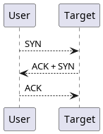
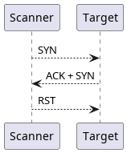
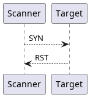
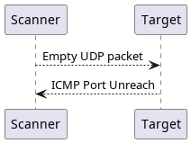
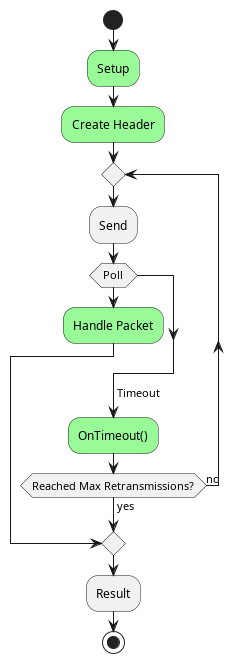
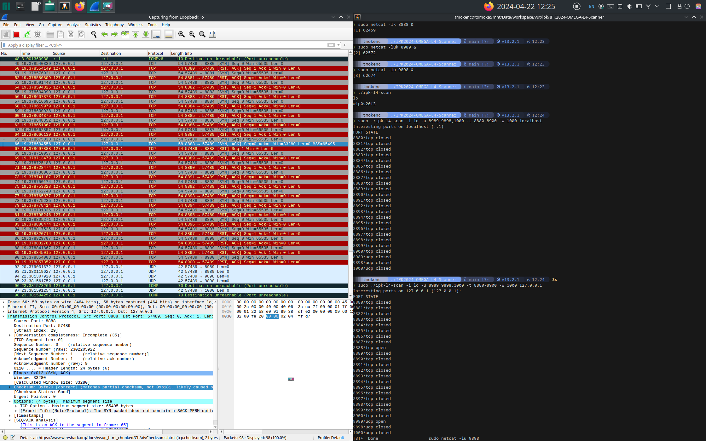

## Table of contents
+ [IPK2024 Projekt 2 OMEGA L4 Scanner](#project)
+ [Introduction](#introduction)
    - [TCP SYN Scanning](#syn)
    - [UDP ICMP Scanning](#icmp)
+ [Usage](#usage)
    - [Arguments](#args)
      - [Ports Format](#ports)
+ [Implementation](#impl)
    - [Scanner](#scanner)
        - [TCP](#tcp)
        - [UDP](#UDP)
    - [Network](#network)
        - [Obtaining the Source Address](#addr)
        - [Checksum](#checksum) 
+ [Testing](#testing)
    - [Testing Devices](#dev)
    - [Testing Environments](#env)
    - [Testing Scenarios](#scenarios)
    - [Testing Tools](#tools)
+ [Note](#note)
+ [Bibliography](#bib)


## IPK Project 2 OMEGA L4 Scanner <a id="project"></a>

- **Language**: C
- **OS**: Linux
- **Author**: Nguyen Le Duy (xnguye27)
- **GIT**: https://git.fit.vutbr.cz/xnguye27/IPK2024-Projekt2-OMEGA
- **Assignment**: https://git.fit.vutbr.cz/NESFIT/IPK-Projects-2024/src/branch/master/Project%202/omega

## Introduction <a id="introduction"></a>

Port scanning is a technique used to identify open ports on a computer or network device. These ports act as virtual doorways, allowing specific services and applications to communicate over a network.

There are various techniques for port scanning, each with its own advantages and limitations. This project utilizes two common methods: TCP SYN scanning [6] and UDP ICMP scanning [7].

### TCP SYN Scanning <a id="syn"></a>

TCP (Transmission Control Protocol) [2] is a reliable, connection-oriented protocol commonly used for network communication. TCP SYN scanning, also known as half-open scanning, exploits the three-way handshake process of the Transmission Control Protocol (TCP) to establish connections.

In TCP SYN scanning, if the target port is open, it responds with a SYN-ACK (synchronize-acknowledge) packet. At this point, the scanner can determine that the port is open without establishing a full connection. To prevent flooding the server [8], a RST (reset) packet is sent back to terminate the communication.

| TCP 3-ways Handshake | TCP Syn Scanning       | TCP closed                |
|:--------------------:|:----------------------:|:-------------------------:|
|    |  |  |

### UDP ICMP Scanning <a id="icmp"></a>

UDP (User Datagram Protocol) [1] is a connectionless, unreliable protocol suitable for quick data transfers. If a UDP port is closed, the target system typically responds with an ICMP Port Unreachable message. However, some systems may not respond consistently.

| UDP ICMP Scanning  |
|:------------------:|
|  |

Unlike TCP, UDP doesn't establish connections before sending data, which make port scanning a lot harder than TCP [7], as the UDP packet we sent does not means it will be delivered as well as the ICMP packet the target host sending back. Not only that, the kernel has a rate limit for generating ICMP unreach packet with default to 1 second per packet.

## Usage <a id="usage"></a>

The program can be built using the `make` command, which will generate an executable file named `ipk-l4-scan`, representing the compiled program.

The program must be executed with root privileges.

### Arguments <a id="args"></a>

| Argument                  | Value                                           | Possible values        | Meaning or expected program behaviour                                             |
| ------------------------- | ----------------------------------------------- | ---------------------- | --------------------------------------------------------------------------------- |
| `-i`, `--interface`       | <span style="color:orange">User provided</span> | Network interface name | Name of the network interface to be used for scanning                             |
| `-t`, `--pt`              | <span style="color:orange">User provided</span> | Ports format           | TCP ports to scan                                                                 |
| `-u`, `--pu`              | <span style="color:orange">User provided</span> | Ports format           | UDP ports to scan                                                                 |
| `-w`, `--pw`              | 5000                                            | Unsigned interger      | Timeout in milliseconds to wait for a response for a single port scan             |
| `-r`, `--retransmissions` | 1                                               | Unsigned integer       | Number of retransmissions while scanning UDP port before coming into a conclusion |
| `-l`, `--ratelimit`       | 1000                                            | Unsigned integer       | Rate limit in milliseconds between two UDP scans                                  |

The last two options were added as additional to the assignment. 

- Higher values for `--retransmissions` decrease the chance of false positives [7]. However, a higher value also increases the scanning time for an opened UDP port linearly. For example, if `-w` is 1000 and `-r` is 3, then scanning an opened port will take `1000 * (3 + 1) == 4000` milliseconds. A value from 1 to 3 is typically sufficient to eliminate false positives.
- The `--ratelimit` parameter is primarily for testing purposes and should not be modified during normal use, as it aligns with the rate limit of the Linux kernel.

#### Ports format <a id="ports"></a>

The ports format supports two different formats:

- `a,b,c`: Specifies specific ports `a`, `b`, and `c`.
- `a-b`: Indicates a port range from `a` to `b` inclusive. `a` must be less than or equal to `b`.

## Implementation <a id="impl"></a>

The project is organized into modules, each consisting of a header file `.h` and an implementation file `.c`.

- `main.c`: This serves as the starting point of the program.
- `scanner`: Defines an interface `Scanner` for port scanning.
  - `udp`: Contains functions for UDP port scanning that utilize the `Scanner` interface.
  - `tcp`: Contains functions for TCP port scanning that utilize the `Scanner` interface.
- `network`: Provides networking utilities.
- `time`: Offers time-related utilities.

### Scanner <a id="scanner"></a>

This module defines the generic `Scanner` interface that TCP/UDP scanner can rely on it.

Before using the scanner, it first need to be setup, that is defines which functions it will call when scanning and which socket it will use for communicating with the target. The number of socket will be 2, one for sending data and other for receiving data, those must be **non-blocking raw sockets**.
Setup functions can be found in `udp` and `tcp` modules.

The scanning proccess is as the following activity diagram.


*Green nodes are custom functions defined by `udp` and `tcp` module*

#### TCP <a id="tcp"></a>

- Sending and receiving both are done through TCP protocol, it will create one socket with `IPPROTO_TCP` and use that for both sending and receiving.
- Number of retransmissions is set to 1.
- On timeout: The port is filtered.
- On packet:
  - If got SYN and ACK flags => the port is open
  - If got RST flags => the port is closed
  - Otherwise port is filtered

#### UDP <a id="udp"></a>

- Socket for sending is created with `IPPROTO_UDP` and socket for receiving is created with `IPPROTO_ICMP` or `IPPROTO_ICMPV6` based on the version of address.
- Number of retransmissions is set base on the command line arguments (default is 1).
- On timeout: The port is open, be aware that it could be filtered or it is a false positive.
- On packet: The port is closed if the ICMP packet is Port Unreach type, that is `type 3 code 3` for IPv4 or `type 1 code 4` for IPv6.

### Network <a id="network"></a>

This module provide various functions to work with networking including:

- socket creation, 
- set/get port of an socket address (`struct sockaddr`), 
- get/print interface and check for validity of an interface name.
- packet checksum.

#### Obtaining the Source Address <a id="addr"></a>

To acquire the source address of an interface that is compatible with the destination address, the process involves utilizing the `connect` function on a socket that operates in a non-connection mode, such as UDP Datagram. This action simply establishes the correct address of the interface without engaging in any actual communication. The source address can then be retrieved using the `getsockname` function. In summary, the algorithm follows these steps:
1. Create a UDP Datagram socket.
2. Use the `connect` function on the socket, specifying the destination address.
3. Retrieve the source address via the `getsockname` function.

#### Checksum <a id="checksum"></a>

Calculating checksums is perhaps the most intricate aspect of this project. Fortunately, the checksums are identical for both TCP and UDP protocols. This is why the `checksum` function is implemented in the `network` module.

The checksum concept involves creating a pseudo header containing the source and destination addresses, packet length, protocol ID, and some padding. This pseudo header is then combined with the packet data to perform the checksum calculation.

When calculating the checksum for TCP/UDP packets, the checksum value within the packet **should be set to 0**.

```
+--------+--------+--------+--------+
|           Source Address          |
+--------+--------+--------+--------+
|         Destination Address       |
+--------+--------+--------+--------+
|  zero  |  PTCL  |  Packet Length  |
+--------+--------+--------+--------+
```

*IPv4 pseudo-header [1], [2]*

```
+-+-+-+-+-+-+-+-+-+-+-+-+-+-+-+-+-+-+-+-+-+-+-+-+-+-+-+-+-+-+-+-+
|                                                               |
+                                                               +
|                                                               |
+                         Source Address                        +
|                                                               |
+                                                               +
|                                                               |
+-+-+-+-+-+-+-+-+-+-+-+-+-+-+-+-+-+-+-+-+-+-+-+-+-+-+-+-+-+-+-+-+
|                                                               |
+                                                               +
|                                                               |
+                      Destination Address                      +
|                                                               |
+                                                               +
|                                                               |
+-+-+-+-+-+-+-+-+-+-+-+-+-+-+-+-+-+-+-+-+-+-+-+-+-+-+-+-+-+-+-+-+
|                         Packet Length                         |
+-+-+-+-+-+-+-+-+-+-+-+-+-+-+-+-+-+-+-+-+-+-+-+-+-+-+-+-+-+-+-+-+
|                      zero                     |  Next Header  |
+-+-+-+-+-+-+-+-+-+-+-+-+-+-+-+-+-+-+-+-+-+-+-+-+-+-+-+-+-+-+-+-+
```

*IPv6 pseudo-header [5]. The `Next Header` field contains the protocol ID.*

These pseudo headers are defined in network.c as structs with memory representation aligned to the specification, named struct pseudo_header_ipv4 and struct pseudo_header_ipv6.

## Testing <a id="testing"></a>

During the testing phase of this project, various devices and environments were scanned to evaluate the effectiveness and accuracy of the OMEGA L4 Scanner. The following testing scenarios and environments were employed:

### Tested Devices <a id="dev"></a>

- Local Devices: Including personal devices such as smartphones, tablets, and computers, as well as devices belonging to friends and colleagues. These devices represent a range of operating systems and network configurations.
- scanme.nmap.org: A public test target provided by the Nmap project, used specifically for IPv6 scan testing.

### Testing Environments <a id="env"></a>

- Manjaro Linux: kernel version 6.6
- Reference Developer Environment [9]

### Testing Scenarios <a id="scenarios"></a>

The testing scenarios were categorized into three main cases:

1. Port Opened: Testing the scanner's ability to accurately identify open ports on target devices.
2. Port Closed: Verifying the scanner's capability to detect closed ports where no active service is listening.
3. Filtered Port: Simulating filtered ports where incoming communication is blocked/filtered.

### Testing Tools <a id="tools"></a>

To simulate open ports during testing, the `netcat` command was utilized:

```sh
netcat -lk <PORT>
```

This command opens a TCP port on the specified `<PORT>`. The `-u` option can be added for UDP ports.

To simulate filtered ports, firewall rules were configured on target devices to block incoming communication to specific ports before initiating scanning operations.

All tests are monitored using `wireshark`


*Sreenshot of a testing session*

## Note <a id="note"></a>

This document was done with the help of [Deepl Write](https://www.deepl.com/write).

## Bibliography <a id="bib"></a>

[1] Postel, J., "User Datagram Protocol", STD 6, RFC 768, DOI 10.17487/RFC0768, August 1980, <https://www.rfc-editor.org/info/rfc768>.

[2] Postel, J., "Transmission Control Protocol", RFC 793, DOI 10.17487/RFC0793, September 1981, <https://www.rfc-editor.org/info/rfc793>.

[3] Postel, J., "Internet Control Message Protocol", STD 5, RFC 792, DOI 10.17487/RFC0792, September 1981, <https://www.rfc-editor.org/info/rfc792>.

[4] Conta, A., Deering, S., and M. Gupta, Ed., "Internet Control Message Protocol (ICMPv6) for the Internet Protocol Version 6 (IPv6) Specification", STD 89, RFC 4443, DOI 10.17487/RFC4443, March 2006, <https://www.rfc-editor.org/info/rfc4443>.

[5] Deering, S. and R. Hinden, "Internet Protocol, Version 6 (IPv6) Specification", RFC 2460, DOI 10.17487/RFC2460, December 1998, <https://www.rfc-editor.org/info/rfc2460>.

[6] Gordon Lyon. TCP SYN (Stealth) Scan (-sS), <https://nmap.org/book/synscan.html> [accessed 22 April 2024]

[7] Gordon Lyon. The Art of Port Scanning, <https://nmap.org/nmap_doc.html#port_unreach> [accessed 22 April 2024]

[8] Wikipedia contributors, 'SYN flood', Wikipedia, The Free Encyclopedia, 16 October 2023, 19:29 UTC, <https://en.wikipedia.org/w/index.php?title=SYN_flood&oldid=1180457507> [accessed 22 April 2024] 

[9] Vladimir Vesely, Daniel Dolejška. IPK 2023/2024, <https://git.fit.vutbr.cz/NESFIT/IPK-Projects-2024> [accessed 22 April 2024]

[10] Free Software Foundation Linux. connect(3) - Linux man page, <https://linux.die.net/man/3/connect> [accessed 22 April 2024]
